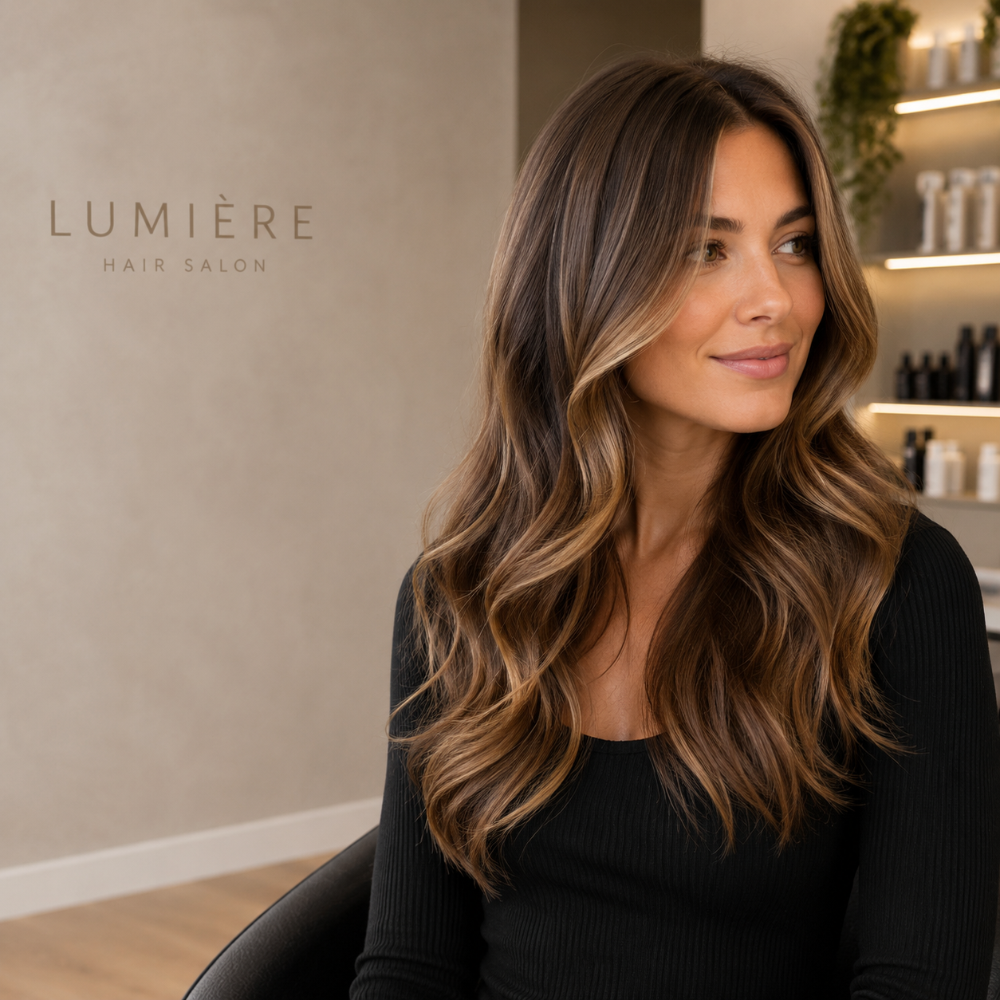
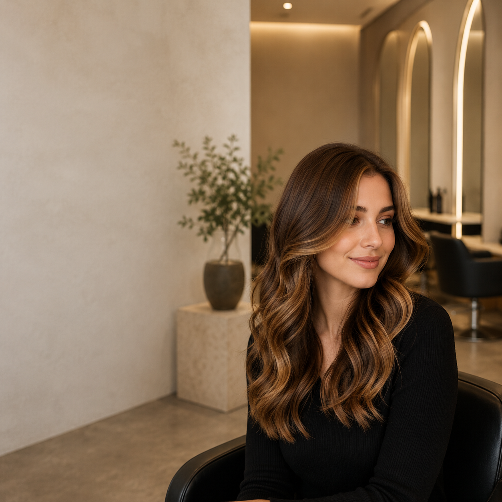

# EmprendeCopy

**Proyecto Final — IA: Entretejiendo Imaginación y Algoritmos**  
**Curso:** 95920 – Inteligencia artificial: Generación de Prompts  
**Alumno:** Diego Javier Pérez

## Resumen

**EmprendeCopy** es una prueba de concepto basada en Inteligencia Artificial Generativa y Prompt Engineering para ayudar a pequeños negocios y emprendimientos a crear contenido promocional para redes sociales.

A partir de datos simples sobre un negocio, servicio, promoción, público y tono, la solución genera un título, un copy, una llamada a la acción, cinco hashtags y un prompt visual. Para el modelo texto-texto utilizo Groq y, para la parte texto-imagen, uso la generación de imágenes de ChatGPT de forma manual.

Durante el proyecto comparé zero-shot y few-shot, medí los resultados con una escala de 0 a 10, realicé una iteración sobre el prompt visual y dejé una versión optimizada que obtiene el contenido textual y el prompt visual con una sola consulta a Groq.

---

## Introducción

### Nombre del proyecto

**EmprendeCopy**

### Problema a abordar

Muchos pequeños negocios usan redes sociales para promocionar productos, servicios y ofertas, pero no siempre tienen tiempo o experiencia en redacción publicitaria y diseño.

Armar una publicación implica pensar qué comunicar, cómo adaptar el mensaje al público, qué tono usar, qué CTA incluir y qué imagen puede acompañar el contenido. La idea del proyecto es reducir ese trabajo inicial mediante IA generativa.

### Propuesta de solución

El usuario proporciona:

- tipo de negocio;
- producto o servicio;
- promoción;
- público objetivo;
- plataforma;
- tono;
- objetivo.

EmprendeCopy genera:

- título;
- copy promocional;
- CTA;
- cinco hashtags;
- prompt visual en inglés.

Groq se utiliza para la parte texto-texto y también para preparar el prompt visual. La imagen se genera después de forma manual con la herramienta de generación de imágenes de ChatGPT.

### Viabilidad

El proyecto es viable porque no necesita entrenar un modelo propio ni desarrollar infraestructura compleja.

La POC utiliza Python, Jupyter Notebook / Google Colab y Groq. La generación de imágenes se realiza manualmente y no requiere integrar una API de imágenes.

El alcance está limitado a generar una publicación promocional como punto de partida, por lo que se mantiene dentro del tiempo y los recursos disponibles.

---

## Objetivos

### Objetivo general

Desarrollar una POC que use técnicas de Fast Prompting para asistir a pequeños negocios en la generación de contenido promocional para redes sociales.

### Objetivos específicos

- Comparar zero-shot y few-shot.
- Medir de forma objetiva la mejora del formato.
- Generar copy promocional a partir de datos simples.
- Generar y refinar un prompt visual.
- Mostrar una iteración texto-imagen completa.
- Evitar consultas innecesarias a la API.
- Resolver el flujo final con una sola consulta a Groq.

---

## Metodología

El proyecto se desarrolló en estas etapas:

1. Definición de un caso de prueba.
2. Prueba zero-shot.
3. Prueba few-shot usando el mismo caso.
4. Evaluación automática y escala de 0 a 10.
5. Generación de una primera imagen.
6. Detección de un problema en el resultado visual.
7. Refinamiento del prompt y generación de una segunda imagen.
8. Implementación final con Structured Outputs.
9. Comparación de consultas, tokens y costos.

---

## Herramientas y tecnologías

- **Python 3**
- **Jupyter Notebook / Google Colab**
- **Groq Python SDK**
- **Modelo:** `openai/gpt-oss-20b`
- **Zero-shot prompting**
- **Few-shot prompting**
- **Iteración de prompts**
- **Structured Outputs / JSON Schema**
- **Generación de imágenes de ChatGPT**

### Few-shot

Elegí few-shot como técnica principal porque EmprendeCopy necesita una salida consistente, no solamente un texto creativo. Los ejemplos ayudan a fijar el formato de título, copy, CTA y hashtags.

La desventaja es que utiliza más tokens de entrada, por eso comparo el costo y dejo la experimentación separada del flujo final.

---

## Implementación

La notebook principal del Proyecto Final es:

[`ProyectoFinal-DiegoPerez.ipynb`](ProyectoFinal-DiegoPerez.ipynb)

Incluye:

- configuración segura de Groq;
- caso de prueba;
- zero-shot;
- few-shot;
- evaluación automática;
- escala de 0 a 10;
- iteración texto-imagen;
- Structured Outputs;
- versión final optimizada;
- tokens y costos;
- opción interactiva.

---

## Resultados

### Texto-texto

La comparación con la escala definida dio:

| Técnica | Puntaje |
|---|---:|
| Zero-shot | **4/10** |
| Few-shot | **10/10** |

El zero-shot genera una respuesta útil, pero no respeta completamente la estructura, devuelve 10 hashtags y agrega un enlace en la bio/DM que no estaba en los datos originales.

Few-shot mantiene mejor el formato solicitado, devuelve exactamente cinco hashtags y evita agregar canales de contacto que no fueron proporcionados.

### Texto-imagen: primera prueba

Prompt original:

> **Professional advertising photograph of a modern women's hair salon, stylish woman with freshly colored glossy hair, elegant minimalist interior, medium close-up composition, warm soft lighting, sophisticated neutral color palette, realistic textures, clean premium aesthetic, empty space for promotional copy, square Instagram composition.**



La imagen cumplió con la estética buscada, pero generó el texto **“LUMIÈRE HAIR SALON”**, algo que no había pedido.

### Texto-imagen: prompt refinado

Prompt final utilizado:

> **Professional advertising photograph of a modern women’s hair salon, stylish woman with freshly colored glossy hair, elegant minimalist salon interior, medium close-up composition, warm soft lighting, sophisticated neutral color palette, realistic textures, clean premium aesthetic, square Instagram composition. Leave clear negative space on the left side for promotional copy to be added later. Do not generate any letters, words, typography, logos, signs, brand names, posters or readable text anywhere in the image.**



La segunda imagen mantiene el contexto de peluquería y la estética profesional, deja espacio libre del lado izquierdo y ya no contiene palabras, logos ni marcas.

| Criterio | Primera imagen | Imagen final |
|---|---|---|
| Estética profesional | Cumple | Cumple |
| Contexto de peluquería | Cumple | Cumple |
| Espacio para copy | Parcial | Cumple |
| Sin texto o marcas generadas | No cumple | Cumple |

### Resultado final de la POC

La versión optimizada produce en una sola consulta:

- título;
- copy;
- CTA;
- cinco hashtags;
- prompt visual.

**Flujo final:**

`Datos del negocio → 1 consulta a Groq → contenido promocional + prompt visual → generación manual de imagen`

Considero que la POC llega a la solución esperada para el alcance definido. El contenido sigue requiriendo una revisión humana antes de ser publicado.

---

## Optimización de consultas y costos

Durante la demostración se realizan tres consultas para comparar técnicas:

- zero-shot;
- few-shot;
- versión final.

En el funcionamiento normal solo es necesaria la última.

La notebook utiliza los tokens informados por Groq para estimar el costo de cada ejecución.

La generación visual se hace manualmente en ChatGPT y no agrega una llamada automatizada a una API de imágenes.

---

## Seguridad

La API key no se guarda en el repositorio.

En Google Colab se utiliza un Secret con el nombre:

`GROQ_API_KEY`

En local puede utilizarse una variable de entorno con el mismo nombre.

---

## Conclusiones

Los objetivos planteados para EmprendeCopy se cumplieron.

Few-shot permitió mejorar de forma clara el cumplimiento del formato frente a la primera prueba zero-shot. La escala de evaluación ayudó a medir esa diferencia con criterios concretos.

La iteración de imagen también mostró una mejora observable: el primer resultado generó texto no pedido y el segundo corrigió ese problema después de reforzar el prompt.

Finalmente, el flujo de uso real quedó reducido a una consulta de texto por publicación, manteniendo la generación visual como un paso manual.

EmprendeCopy no busca reemplazar al usuario, sino darle un punto de partida más rápido y estructurado que pueda revisar y adaptar antes de publicar.

---

## Estructura del repositorio

```text
EmprendeCopy-IA-Generacion-De-Prompts-Perez/
├── README.md
├── ProyectoFinal-DiegoPerez.ipynb
├── requirements.txt
├── .gitignore
└── assets/
    ├── peluqueria-generada.png
    ├── peluqueria-final.png
    └── README.md
```

---

## Referencias

- Groq — GPT OSS 20B: https://console.groq.com/docs/model/openai/gpt-oss-20b
- Groq — Structured Outputs: https://console.groq.com/docs/structured-outputs
- Groq — Modelos disponibles: https://console.groq.com/docs/models

**Nota:** para las estimaciones de costos de la notebook utilicé las tarifas consultadas el 23/08/2026. Estos valores pueden cambiar.
